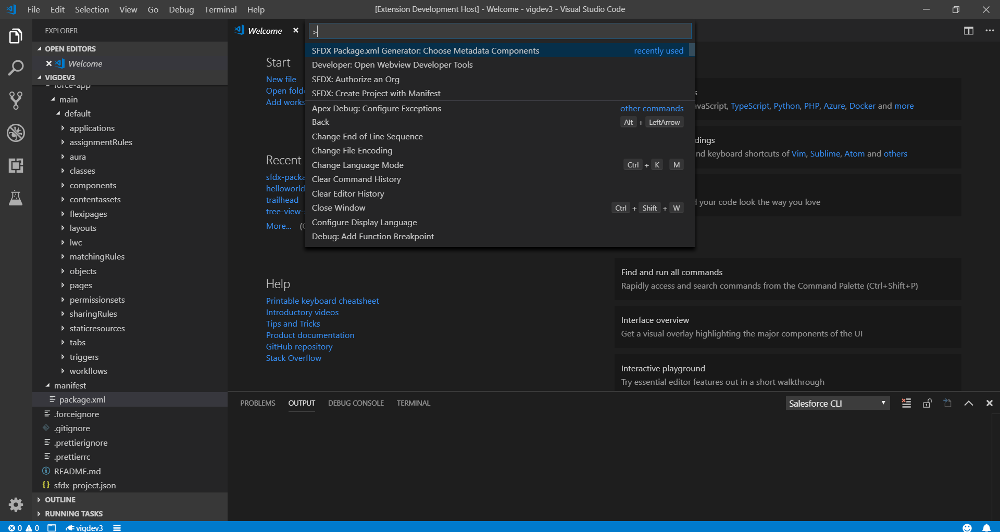
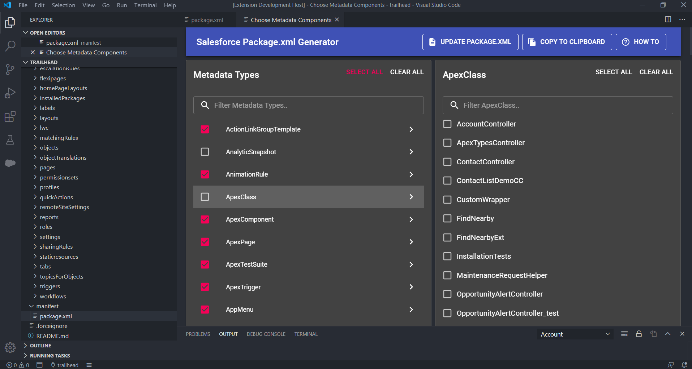

# Salesforce Package.xml Generator Extension for VS Code

This extension provides a User Interface to choose metadata components for Package.xml file for development against sandboxes or DE orgs (Org Development Model with VS Code). This is similar to Eclipse Force.com IDE Add/Remove Metadata Components option.

## Prerequisites
Before you set up Salesforce Package.xml Generator Extension for VS Code, make sure that you have these essentials.

- Salesforce Extensions for Visual Studio Code
- Visual Studio Code v1.26 or later

## Screenshots

## How to use?
- Setup your project using **SFDX: Create Project with Manifest** command and authorize it using **SFDX: Authorize an Org command**. Skip this step if already done.
For more details refer [Org Development Model with VS Code] (https://forcedotcom.github.io/salesforcedx-vscode/articles/user-guide/org-development-model). 
- Open the command palette (press Ctrl+Shift+P on Windows or Linux, or Cmd+Shift+P on macOS) and run **SFDX Package.xml Generator: Choose Metadata Components** command.
- In Choose Metadata Components for Package.xml page, select the Metadata you need and click on **Update Package.xml** button.
- Package.xml file opens up with the selected metadata components.
- Open the command palette (press Ctrl+Shift+P on Windows or Linux, or Cmd+Shift+P on macOS) and run **SFDX: Retrieve Source in Manifest from Org**
- If you don't want to modify the existing package.xml file & only want to generated xml content, click on **Copy to Clipboard** button. This copies the formatted package.xml contents to clipboard to be pasted somewhere else.
